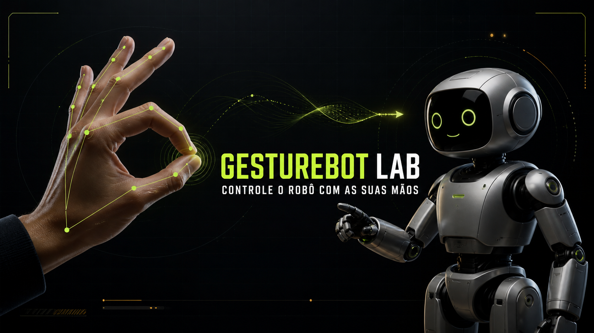

# GestureBot Lab



Uma interface experimental que usa a câmera e visão computacional para transformar movimentos dos dedos em movimentos de um robô articulado — tudo em tempo real e diretamente no navegador.

## O que já funciona

- Ativação consciente da câmera por clique.
- Rastreamento de até duas mãos com 21 pontos por mão.
- Esqueleto visual sobre o vídeo ao vivo.
- Leitura contínua da flexão de cada dedo.
- Robô lateral com cabeça, braços e pernas articulados.
- Suavização dos movimentos para reduzir tremores.
- Telemetria de FPS, latência, confiança e mão detectada.
- Interface responsiva para desktop e celular.
- Processamento local: os frames da câmera não são enviados para um servidor do projeto.

## Mapa inicial de controle

| Dedo | Parte do robô | Movimento |
| --- | --- | --- |
| Polegar | Perna esquerda | Flexão do dedo → rotação da perna |
| Indicador | Braço esquerdo | Flexão do dedo → rotação do braço |
| Médio | Cabeça | Deslocamento lateral → inclinação da cabeça |
| Anelar | Braço direito | Flexão do dedo → rotação do braço |
| Mínimo | Perna direita | Flexão do dedo → rotação da perna |

## Rodando localmente

Requisitos: Node.js 22.13 ou superior e acesso à internet para baixar o modelo do MediaPipe na primeira execução.

```bash
npm install
npm run dev
```

Abra `http://localhost:3000`, clique em **Iniciar** e libere a câmera.

Para validar a versão de produção:

```bash
npm run build
```

## Como a lógica funciona

1. O MediaPipe Hand Landmarker encontra 21 pontos normalizados em cada mão.
2. O canvas espelha o vídeo e desenha conexões e pontos por grupo de dedos.
3. Ângulos das articulações PIP e DIP viram um valor de flexão entre `0` e `1`.
4. Cada valor alimenta uma parte do robô de acordo com o mapa acima.
5. Uma interpolação suaviza a pose antes da renderização.

O MVP roda inteiramente no cliente e não exige backend, login ou armazenamento.

## Próximas evoluções

- Tela para remapear livremente dedo → articulação.
- Calibração personalizada de mão aberta e fechada.
- Robô 3D com rig e animações mais complexas.
- Gravação do vídeo de demonstração dentro da interface.
- Perfis de gestos, coreografias e exportação de movimentos.
- Modo WebXR e integração futura com um robô físico.

## Tecnologias

- React 19
- Next.js / Vinext
- MediaPipe Tasks Vision
- Canvas 2D
- TypeScript

## Licença

MIT — veja [LICENSE](./LICENSE).
